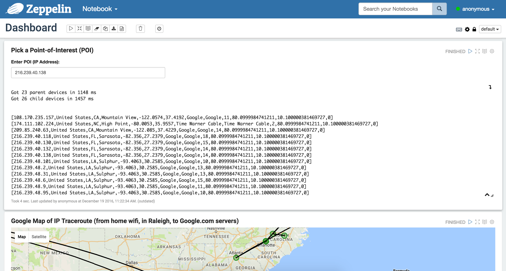
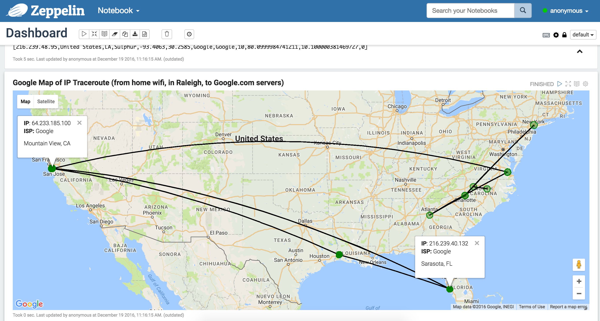

<h3>Network Topology Analysis</h3>
This repo contains the code used to collect network topology data (using a traceroute script), the <a href="http://spark.apache.org/">Apache Spark</a> code used for real-time analysis, and the <a href="https://zeppelin.apache.org/">Zeppelin</a> notebook used for data visualization.
<br>
<br>A network topology consists of many nodes (or hosts) and edges (connections) that link each of the nodes. In communication systems, there are typically many routes that we can take to get from Point A to Point B. 
<br>
<br>For example, if you are on your home wifi (Point A) and you request a webpage from Google.com (Point B), then your request will be relayed through many hosts along the route. Each time you make the request, a slightly different path may be used based on how the network is optimized, timeouts, failed nodes, etc. 
<br>
<br>For communication providers, these failed nodes create a problem. Isolating and resolving the issue is critical, since a failed node reduces performance, may cause downtime, cost money if a truck or person needs to manual troubleshoot a node, etc.
<br>
<br>This example focuses on a network topology for telecom, but the process and technology can be extended to any use case that involves a topology or hierarchy of information that needs to be analyzed in real-time.
<br>
<br>To Run:
<br>
<br>1. Clone this repo
<br>2. Navigate to the docker directory
<br>3. Execute ```./run.sh``` (You'll need to have <a href="https://www.docker.com/">Docker</a> installed on your machine)
<br>4. Enter the Zeppelin container bash (```docker exec -it zeppelin bash```)
<br>5. 
<br>
<br>Zeppelin notebook screenshot showing the user-input, where IP addresses (or points of interest) can be entered within the Zeppelin. This input is fed into a Spark job that fetches the data from HBase, performs data processing, then feeds the results to angular where it is rendered within Google Maps.
<br>
<br>
<br>Zeppelin notebook screenshot showing the IP traceroute from my home wifi in Raleigh to Google.com servers (in Mountain View, CA). 
<br>
<br>
<br><b>References:</b>
<br>&bull; <a href="http://zeppelin.apache.org/docs/latest/displaysystem/front-end-angular.html">Apache Zeppelin - Angular (front-end API)</a>
<br>&bull; <a href="http://zeppelin.apache.org/docs/latest/displaysystem/back-end-angular.html">Apache Zeppelin - Angular (back-end API)</a>
